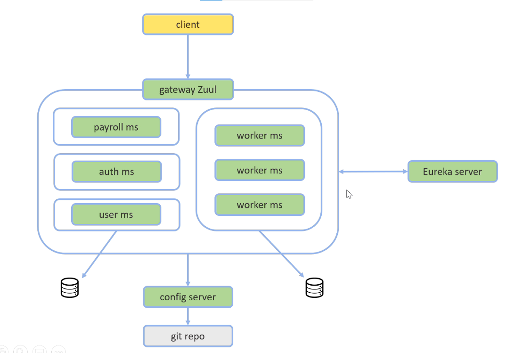
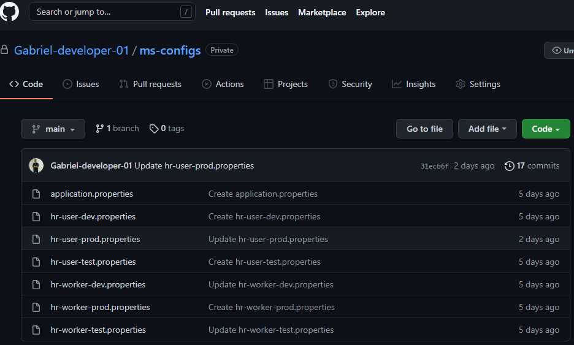

<h1 align="center">Microsserviços Java com Spring Boot e Spring Cloud</h1>

Esse projeto é um sistema composto por vários microsserviços que comunicam entre si de forma **transparente**, **escalável** e com **balanceamento de carga**.

Para isso foi utilizado ferramentas do **Spring Cloud** como:

### RestTemplate e OpenFeign
RestTemplate é uma classe do Spring projetada para chamar serviços REST.

Feign também é utilizado para integração com serviços REST. Foi arquitetado para permitir requisições de API entre microsserviços de forma simples. Além disso, tem suporte para trabalhar com outras bibliotecas como Hystrix, Eureka e Ribbon.

Algumas vantagens que o OpenFeign tem sobre o RestTemplate:

 

  <ol>
    <li>Não precisa escrever classes de implementação para chamar outros serviços, apenas fornecer especificação como uma Interface</li>
    <li>As configurações do cliente, como codificação/decodificação, tempo limite, registro em log, podem ser feitas apenas por meio de arquivos de propriedades.</li>
    <li>As configurações do cliente também podem ser feitas a partir do arquivo de configuração Java.</li>
    <li>Tem um ótimo suporte para trabalhar com outras bibliotecas do Spring Cloud NetFlix como Hystrix, Eureka e Ribbon</li>
    <li>Spring Boot fornece suporte para escrever casos de teste para Feign Client usando WireMock</li>
    <li>Forneça suporte para dados de fallback se a chamada da API falhar.</li>
  <ol>

    
### Este é um mapa com os principais recursos atuais fornecidos pelo feign:
    

    
[Spring Cloud OpenFeign](https://docs.spring.io/spring-cloud-openfeign/docs/current/reference/html/) 
[Integração de APIs com o OpenFeign](https://cwi.com.br/blog/integracao-de-apis-com-o-openfeign/)
    
### Eureka
O Eureka é um serviço REST que é usado para localizar serviços com o objetivo de balanceamento de carga. Ele permite que serviços sejam registrados através do Eureka Server e descobertos através do Eureka Client,

Os microsserviços são registrados em um "Discovery Server" (Eureka), de modo que a comunicação entre eles é feita pelo nome do microsserviço.

Para se aprofundar melhor sobre esse assunto: [Artigo Eureka](https://medium.com/@michellibrito/netflix-eureka-comunica%C3%A7%C3%A3o-entre-microservices-383d32d39506) artigo bem interessante.

### Ribbon
É responsável por realizar a comunicação entre os diversos microservices e fazer o balanceamento de carga. O Ribbon também faz o tratamento de uma eventual falha em uma chamada de um microservice.

Referência: [sobre ribbon](https://blog.andrefaria.com/monolitico-aos-microservices-com-netflix-oss)

### Hystrix
O hystrix é uma ferramenta que ajuda na falha de disponibilidade no projeto. Quando um determinado microservice falhar, ele “abrirá o circuito” e direcionará as chamadas para um outro microservice que atuará como um fallback.

Referência: [sobre hystrix](https://blog.andrefaria.com/monolitico-aos-microservices-com-netflix-oss)
### Zuul
Zuul Server é um aplicativo API Gateway. Ele lida com todas as solicitações e executa o roteamento dinâmico de aplicativos de microsserviço.

Foi utilizado para fazer requisições, ou seja, ele é responsável por rotear e autorizar as requisições nesse projeto.

### Servidor de autorização (Oauth2)

### Servidor de configuração
Tem o objetivo de centralizar toda a configuração da nossa rede de Microservices em um só lugar. 

Todos os arquivos de configuração do nosso sistema estarão em um repositório git e o Servidor de Configuração será o responsável por ler as informações no repositório e fornece-las às aplicações através de requests HTTP.

## 🎯 Dependências para rodar a aplicação

- `Java 11`
- `STS - Spring Tool Suite versão 2.3.x`
- Docker / Docker Desktop

> Obs: Algumas bibliotecas foram descontinuadas, então essa versão do sts é necessária para não gerar bugs.

